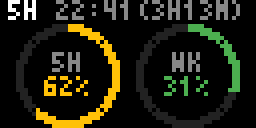
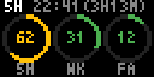

# claude-usage — Tronbyt app

Shows your Claude subscription usage limits (the same numbers as Claude
Code's `/usage` command) as radial ring gauges on a 64×32
[Tronbyt](https://github.com/tronbyt)/Tidbyt display.




- One ring per limit: 5-hour session, weekly, and (if your plan reports one)
  a model-scoped weekly limit. Green < 50%, amber 50–79%, red ≥ 80%.
- Top row counts down to whichever limit is closest to its cap
  (toggleable in the app config).
- Amber pixel in the top-right corner = showing cached data because the
  last fetch failed.

## How it works

Anthropic's usage endpoint needs an OAuth token that only Claude Code
logins hold, and its standalone OAuth flow is unreliable (persistent
429s on token exchange). So a small **companion server** runs on a
machine where Claude Code is logged in, borrows Claude Code's own
(always-fresh) credentials, and republishes just the usage JSON on your
network. The Pixlet app fetches that URL — no secrets on the Tronbyt.

```
Claude Code keychain ──> scripts/serve_usage.py ──> http://mac:8377/usage.json ──> claude_usage.star
```

## Setup (push model — recommended)

Networks with client isolation often block the Tronbyt box from reaching
your Mac. The push model needs only *outbound* connections from the Mac:
render locally, push the frame to tronbyt-server's Tidbyt-compatible API.

1. **Run the companion** on the Mac where you use Claude Code (localhost
   only is fine in this model):

   ```
   python3 scripts/serve_usage.py
   ```

2. **Push on a schedule** with `scripts/render_push.sh`:

   ```
   TRONBYT_URL=http://<tronbyt-server>:8100 DEVICE_ID=<id> API_KEY=<key> \
       scripts/render_push.sh
   ```

   Wrap both in launchd agents to keep them running (StartInterval 60 for
   the push; keep the API key in the plist, not in the repo).

## Setup (server-side render — if the server can reach your Mac)

1. Run the companion with `--bind 0.0.0.0 --port 8377` (serves only usage
   percentages, no secrets).
2. Upload `claude_usage.star` as a custom app in the Tronbyt web UI.
3. Set its **Data URL** config to `http://<your-mac>:8377/usage.json`.

The display shows `SET DATA URL` until configured, `TOKEN EXPIRED`/`HTTP n`
frames if the companion can't reach Anthropic, and keeps rendering cached
numbers (with the amber stale pixel) through short outages.

## Development

```
pixlet render claude_usage.star dev_mock=happy -o /tmp/out.gif --magnify 8
```

`dev_mock` presets: `happy`, `high`, `zero`, `scoped` (three rings),
`expired`, `outage`. `self_test=1` runs built-in asserts. See
`docs/api-notes.md` for the verified usage-endpoint response shape and
`docs/plans/` for the design history.
